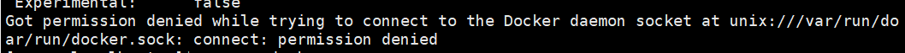

## 一、Docker介绍


## 二、Docker基本概念


## 三、Docker安装


Docker 安装文档: https://docs.docker.com/engine/install/centos/

## 四、Docker镜像


## 相关问题

### 配置docker阿里云镜像加速

> ```shell
> sudo mkdir -p /etc/docker
> sudo tee /etc/docker/daemon.json <<-'EOF'
> {
>   "registry-mirrors": ["https://lcr0676y.mirror.aliyuncs.com"]
> }
> EOF
> sudo systemctl daemon-reload
> sudo systemctl restart docker
> ```


### docker安装mysql

到镜像仓库搜索mysql

```shell
# 下载指定版本的
docker pull mysql:5.7
```

查看镜像

```shell
docker images
```


### 在用户权限下docker 命令需要 sudo 否则出现以下问题的解决

```shell
Got permission denied while trying to connect to the Docker daemon socket at unix:///var/run/docker.sock: Get http://%2Fvar%2Frun%2Fdocker.sock/v1.40/version: dial unix /var/run/docker.sock: connect: permission denied
```



通过将用户添加到docker用户组可以将sudo去掉，命令如下

sudo groupadd docker #添加docker用户组 

sudo gpasswd -a $USER docker #将登陆用户加入到docker用户组中 

newgrp docker #更新用户组


### Docker更改默认存储路径

**在linux下通常docker都是默认安装的，且默认的镜像，容器存储路径都位于/var/lib/docker中，可以通过docker info命令来查看，如下：**